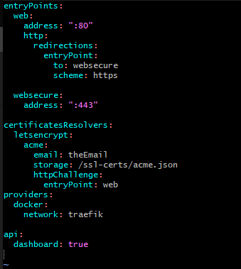
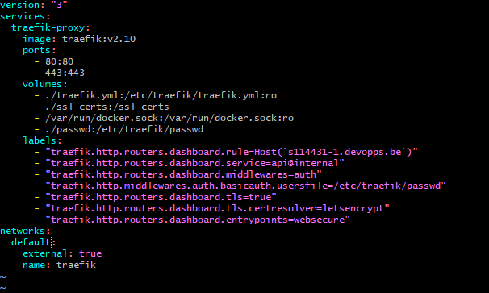
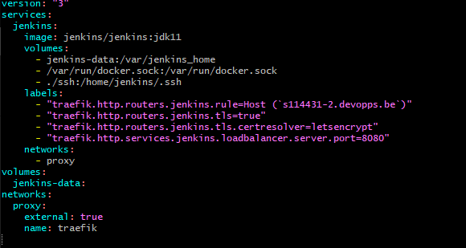

Dit README-bestand biedt stapsgewijze instructies voor het instellen en implementeren van het "projectopdracht-Nauwelaert" project met behulp van DevOps-praktijken. Volg de onderstaande secties om de projectomgeving succesvol te configureren.

# Het Klonen van de Repository

## Kloon de projectrepository:

  ``` git clone https://github.com/AP-IT-GH/projectopdracht-Nauwelaert.git ```
  
Ga naar de project folder en hier ga je de .env.example file copieren naar een .env file, de docker-compose.yml file zal deze gegevens uitlezen. 
 ``` cp .env.example .env  ```

Open de nieuw gemaakte .env file en geef de database en het wachtwoord op: 
``` mysqldb=[deDatabaseNaam] ```
``` mysqlpwd=[hetWachtwoord] ```

   

## Configuratie van Traefik Reverse Proxy

Een reverse proxy wordt gebruikt om de prestaties, beveiliging en schaalbaarheid van webtoepassingen te verbeteren.
Zorg ervoor dat SSH-sleutels zijn gegenereerd en geconfigureerd.

Maak een nieuwe directory genaamd traefik in de root aan.
Maak hier nadien een Traefik-configuratiebestand (traefik.yml) aan met de gegeven inhoud.

 ``` traefik.yml  ```
 


maak ook een docker-compose.yml file aan die er als volgt uitziet:


Start Traefik op:
 ``` docker-compose.yml up -d  ```


## Jenkins Pipeline

Jenkins wordt ingezet om continue integratie en continue levering (CI/CD) te automatiseren, waardoor er efficiënter kan worden samengewerkt, er snellere software-iteraties kunnen worden gerealiseert en de kwaliteit van de ontwikkelde software kan worden gewaarborgd.

maak buiten in de root een directory aan genaamd jenkins. 
hier maak je een docker-compose.yml file aan die er als volgt uitziet: 


 Start jenkins op:
```  docker-compose up -d  ```

 Open Jenkins op https://s114431-2.devopps.be/ en doorloop de initiële configuratie.

  Voeg een SSH-agent toe in Jenkins met de gegenereerde SSH-sleutel.

  Maak een nieuwe Jenkins-pipeline-job aan en configureer deze.

  Bouw en implementeer het project met behulp van de Jenkins-pipeline.

Nu is je DevOps-omgeving ingesteld en is het project klaar voor implementatie.

## Projectopdracht

Welkom bij het de repository voor de doorlopende opdracht van DevOps. 

### Situatie

Je werkt voor ACME. Ze hebben onlangs een todo-applicatie ontwikkeld. 
Je wordt gevraagd om een DevOps pipeline uit te werken. Hiervoor zal je op een remote Linux machine werken.

Er zijn twee onderdelen: Back-end en Front-end. Er is geen authenticatie.

De back-end is een NodeJs applicatie die de API host. De back-end luistert op poort 3000. 
De back-end draait standaard in-memory. Met andere woorden, de taken worden enkel opgeslagen in geheugen, niet op disk. 
De back-end kan ook een connectie maken naar een mysql databank. Die stel je in met volgende environment variabelen:

* STORAGE=mysql
* MYSQL_HOST=<hostname>
* MYSQL_USER=<username>
* MYSQL_PWD=$mysqlpwd 
* MYSQL_DB=$mysqldb

De Front-end is een HTML5 statische applicatie en luistert op poort 80. 
Via AJAX calls wordt de API aangeroepen. De front-end en de API moeten op dezelfde host draaien. 
De API draait in een subfolder /api.

### Architectuur


### Opdracht:

1. Connecteer naar je Debian Linux omgeving
1. Clone deze repository
1. Bouw een container voor de back-end. De back-end draait op NodeJS. Kies zelf een tag.
1. Bouw een container voor de front-end. De front-end draait op Nginx. Je maakt gebruik van nginx. Je kan gebruik maken van de standaard configuratie.
1. Maak een docker compose file aan die deze containers refereert. Expose je front-end op poort 80.
1. Voeg Mysql toe aan je netwerk dmv een docker container. Je maakt gebruik van een mysql image. Voeg disk mappings toe zodat de state van je mysql container bewaard blijft.
1. De repository bevat een bestand init.sql. Zorg dat dit wordt uitgevoerd bij de start van de Mysql container. 
1. Configureer de API zodat die deze MySql databank gebruikt.
1. Installeer Traefik als Reverse proxy op je omgeving.
1. Configureer ssl certificaat aanvraag via LetsEncrypt
1. Expose de todo applicatie op ```https://<studentnr>.devops-ap.be```
